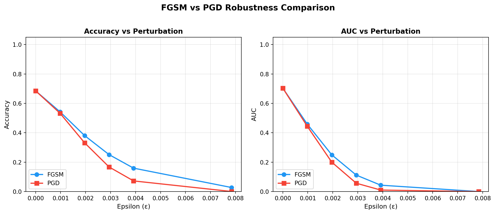
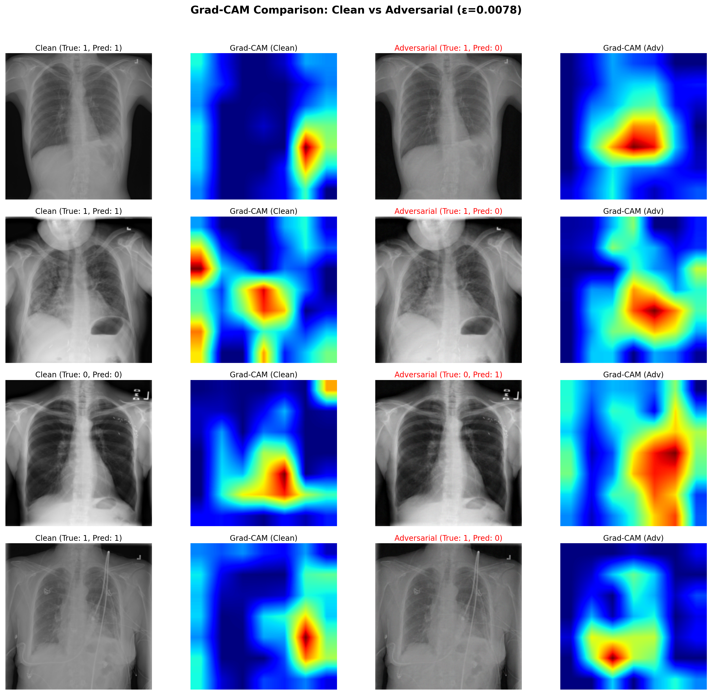

# Evaluating Adversarial Robustness of Deep Learning Models for Medical Chest X-ray Classification

[](https://www.python.org/)
[](https://pytorch.org/)
[](LICENSE)

## Overview

This project presents a comprehensive evaluation of adversarial robustness for deep learning models used in medical chest X-ray classification. We systematically investigate the vulnerability of a ResNet-18 classifier trained on the NIH ChestX-ray14 dataset under two prominent adversarial attack methods: **Fast Gradient Sign Method (FGSM)** and **Projected Gradient Descent (PGD)**.

### Key Findings

| Attack | ε = 0 (Clean) | ε = 2/255 | Accuracy Drop |
|--------|---------------|-----------|---------------|
| FGSM | 68.51% | 2.80% | -65.71% |
| PGD | 68.51% | 0.08% | -68.43% |

**Critical Discovery**: Imperceptible perturbations can cause complete model failure, highlighting the urgent need for robustness evaluation before clinical deployment.

## Project Structure

```
project_root/
├── attacks/                 # Adversarial attack implementations
│   ├── fgsm.py             # Fast Gradient Sign Method
│   ├── pgd.py              # Projected Gradient Descent
│   └── attack_runner.py    # Unified attack interface
├── robustness/             # Robustness evaluation
│   ├── eval_fgsm.py        # FGSM evaluation
│   ├── eval_pgd.py         # PGD evaluation
│   └── eval_robustness.py  # Comparison analysis
├── training/               # Model training
│   ├── train_baseline.py   # Baseline model training
│   ├── eval_clean.py       # Clean accuracy evaluation
│   ├── eval_confusion.py   # Confusion matrix
│   └── ROC.py              # ROC curve analysis
├── visualization/          # Visualization tools
│   └── run_visualization.py # Grad-CAM and adversarial examples
├── dataset/                # Dataset preprocessing
│   ├── dataset_prep.py     # Data preparation pipeline
│   └── test_dataset.py     # Dataset verification
├── utils/                  # Utilities
│   ├── config.py           # Centralized configuration
│   └── common.py           # Shared functions
├── tools/                  # Helper tools
│   └── filter_missing_images.py
├── models/                 # Saved model checkpoints
├── results/                # Generated figures and metrics
├── thesis/                 # Thesis documents
└── main.py                 # Main entry point
```

## Installation

### Requirements

- Python 3.8+
- PyTorch 2.0+ with CUDA support
- NVIDIA GPU (recommended)

### Setup

```bash
# Clone the repository
git clone https://github.com/YOUR_USERNAME/chest-xray-adversarial-robustness.git
cd chest-xray-adversarial-robustness

# Create virtual environment
python -m venv venv
source venv/bin/activate  # On Windows: venv\Scripts\activate

# Install dependencies
pip install -r requirements.txt
```

## Dataset

This project uses the [NIH ChestX-ray14 dataset](https://nihcc.app.box.com/v/ChestXray-NIHCC).

1. Download the dataset from the official source
2. Extract images to `dataset/raw/`
3. Run preprocessing:

```bash
python dataset/dataset_prep.py
```

## Usage

### Train Baseline Model

```bash
python training/train_baseline.py
```

### Evaluate Robustness

```bash
# FGSM evaluation
python robustness/eval_fgsm.py

# PGD evaluation
python robustness/eval_pgd.py

# Generate comparison
python robustness/eval_robustness.py
```

### Generate Visualizations

```bash
python visualization/run_visualization.py
```

### Run Complete Pipeline

```bash
python main.py
```

## Results

### Robustness Curves



### Adversarial Examples


### Grad-CAM Analysis



## Evaluation Metrics

- **Accuracy**: Classification accuracy under attack
- **AUC-ROC**: Area under the ROC curve
- **Sensitivity/Specificity**: Clinical performance metrics
- **ECE**: Expected Calibration Error
- **Grad-CAM**: Visual attention analysis

## Citation

If you use this code in your research, please cite:

```bibtex
@thesis{yan2026adversarial,
  title={Evaluating Adversarial Robustness of Deep Learning Models for Medical Chest X-ray Classification},
  author={Yan, Ruifeng},
  year={2026},
  school={University of Dundee},
  type={Honours Project}
}
```

## References

- [1] Goodfellow et al. "Explaining and Harnessing Adversarial Examples" (ICLR 2015)
- [2] Madry et al. "Towards Deep Learning Models Resistant to Adversarial Attacks" (ICLR 2018)
- [3] Wang et al. "ChestX-ray8" (CVPR 2017)
- [4] He et al. "Deep Residual Learning for Image Recognition" (CVPR 2016)
- [5] Selvaraju et al. "Grad-CAM" (ICCV 2017)

## License

This project is licensed under the MIT License - see the [LICENSE](LICENSE) file for details.

## Acknowledgments

- Supervisor: Perley Xu
- University of Dundee, School of Science and Engineering
- NIH Clinical Center for providing the ChestX-ray14 dataset

## Contact

- **Author**: Ruifeng Yan
- **Email**: [your-email@example.com]
- **Project Link**: [https://github.com/YOUR_USERNAME/chest-xray-adversarial-robustness](https://github.com/YOUR_USERNAME/chest-xray-adversarial-robustness)
